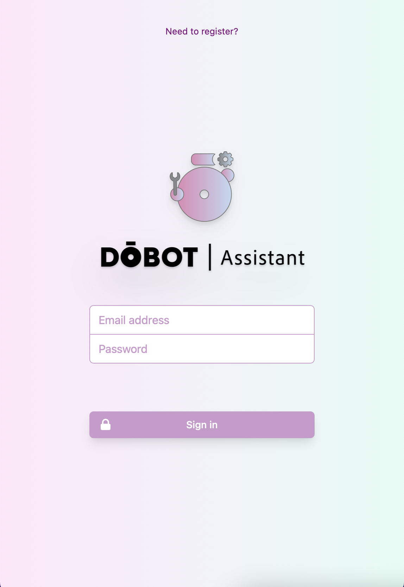
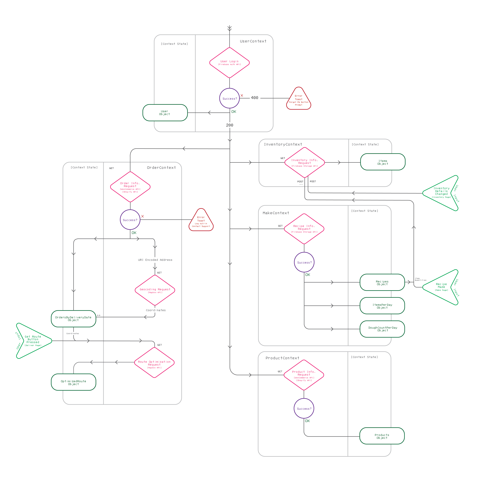
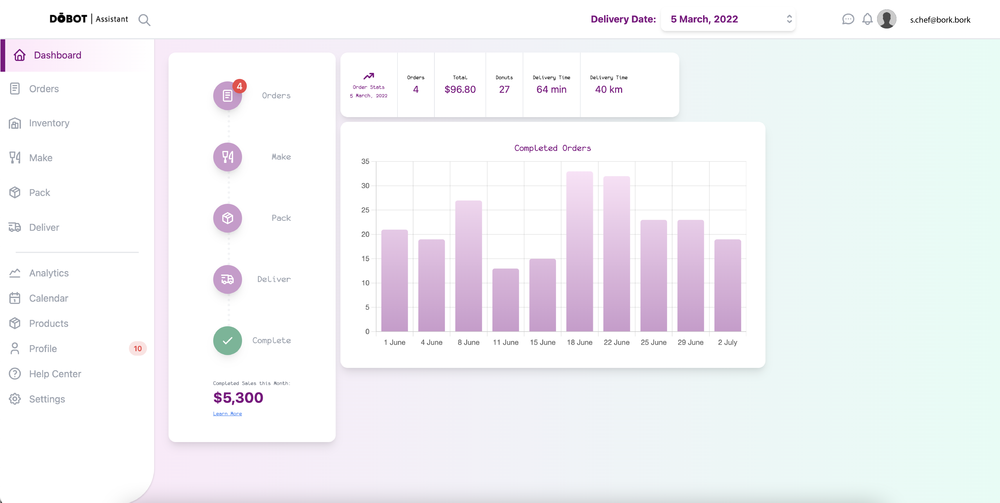
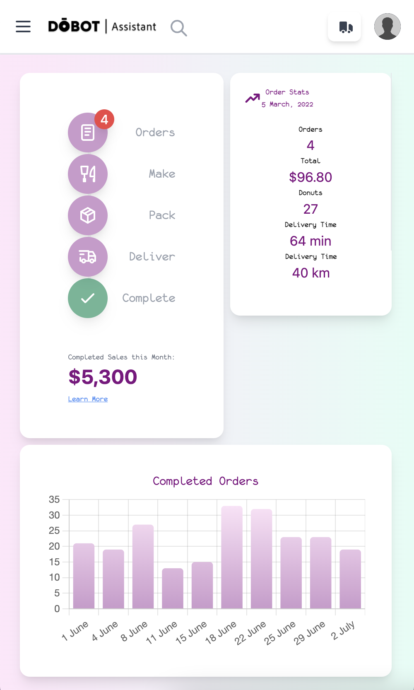
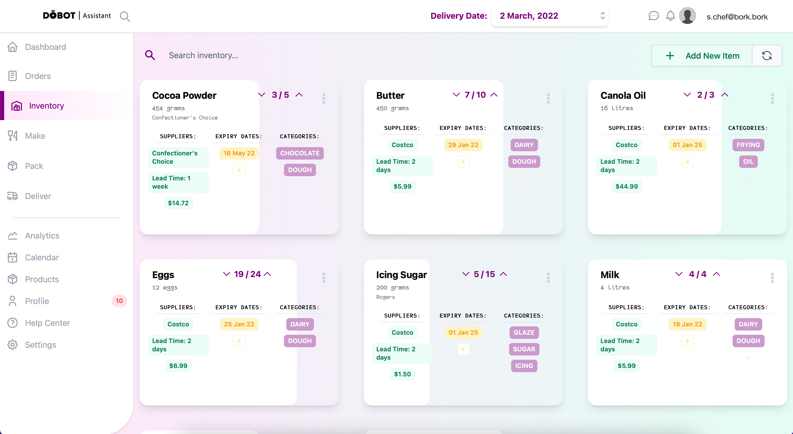
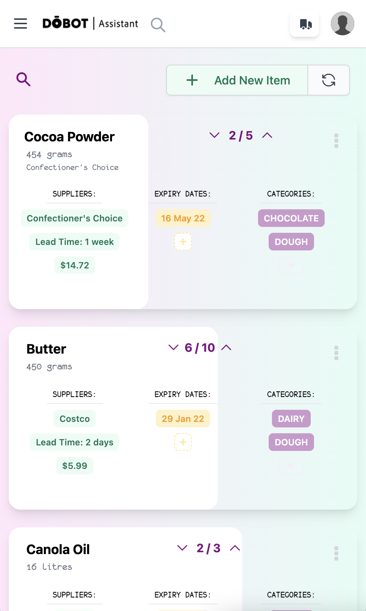
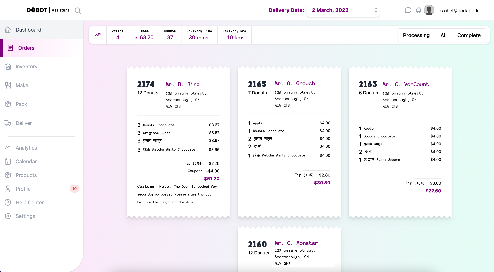
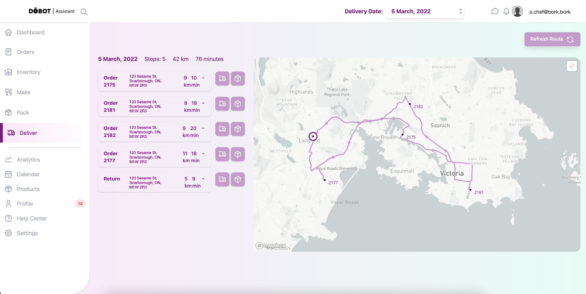
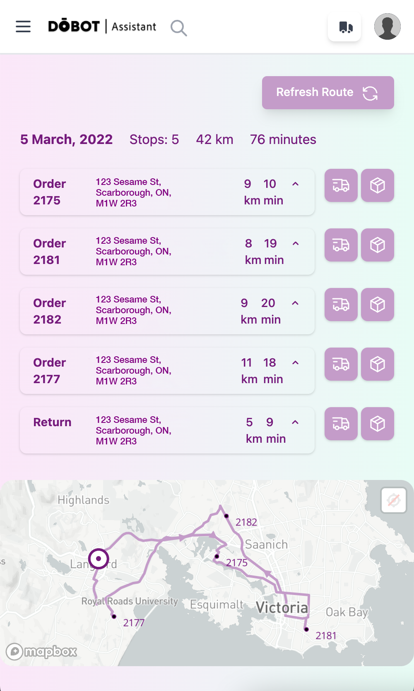

---
In-progress full-suite enterprise responsive web application for bakeries and small food based delivery businesses.
Modules for kitchen and recipe management, inventory management, packaging and printing labels, and delivery route maps/optimization with automated customer email notifications. Integrates with WordPress and Woocommerce GraphQL endpoints to obtain order information. Shopify integration in the pipeline. 

The main objective is to increase success and sales of local small food delivery businesses and the bakery/pâtisserie industry.

 

## 1.0 Overview
Upon login, the app makes requests to Woocommerce/WordPress REST endpoints to obtain order information. This is then reformatted into an object organised by delivery date. This is the one source of truth for the "Delivery Date" dropdown which changes all the information displayed in the UI. The order information is sensitive (customer addresses, etc.) and is never set into local storage. 

Upon login, requests are also made to the Mapbox API to geocode addresses, ready for route optimisation. Recipes and inventory information is obtained from Firebase. 

## 2.0 Dashboard
Screenshots of dashboard in progress. There will be a widget selector with various options in the final version. 

## 3.0 Inventory
Linked to firebase database. Successful edits notified to user via toasts. The card background fill is a visual representation of the number of items in stock versus par level. Options to track suppliers, expiry dates, categories. Duplicate, delete, edit, view history via popup menu. 

## 4.0 Orders
Order browser. Important information per delivery day on toolbar. 

## 5.0 Deliver
Optimized delivery route provided by Mapbox API. Step by step directions and prompts included. User location provided via browser Geolocation API. 

Email prompts for 30 minute delivery window and completed delivery via buttons. 

## 6.0 a11y, i18n & l10n
### 6.1 a11y
Continue checking against [A11y Project Checklist](https://www.a11yproject.com/checklist/)

### 6.2 i18n & l10n
Look into [React-i18next](https://react.i18next.com) and [React-intl](https://formatjs.io/docs/react-intl/components/)

## 7.0 Testing
Jest & RTL:

[Jest DOM Testing Docs](https://jestjs.io/docs/en/tutorial-react#dom-testing)

[Guide to Testing React Apps](https://thomlom.dev/beginner-guide-testing-react-apps/)

\
Cypress:

[Cypress Docs: Writing Tests](https://docs.cypress.io/guides/core-concepts/writing-and-organizing-tests.html#Writing-tests)

[Cypress Docs Typescript Support](https://docs.cypress.io/guides/tooling/typescript-support.html#Types-for-plugins)

[Webstorm Plugin](https://plugins.jetbrains.com/plugin/13819-cypress-support)

## 8.0 Security
API validation, Captchas, Input sanitization, WAF & URL parsing. Research:
[OWASP Web Security Testing Guide](https://owasp.org/www-project-web-security-testing-guide/)

## 9.0 Speed
[Smashing Magazine Front End Performance Checklist 2021](https://www.smashingmagazine.com/2021/01/front-end-performance-2021-free-pdf-checklist/)

## 10.0 Future Directions
Research:

[Storybook.js](https://www.learnstorybook.com)

[PWA - Workbox](https://developers.google.com/web/tools/workbox/modules/workbox-webpack-plugin)
---

🧑‍💻 → 🧾 → 👩‍🍳 → 🧁 🍩 🍞 🍪 → 📦 → 🚚 →  😁

